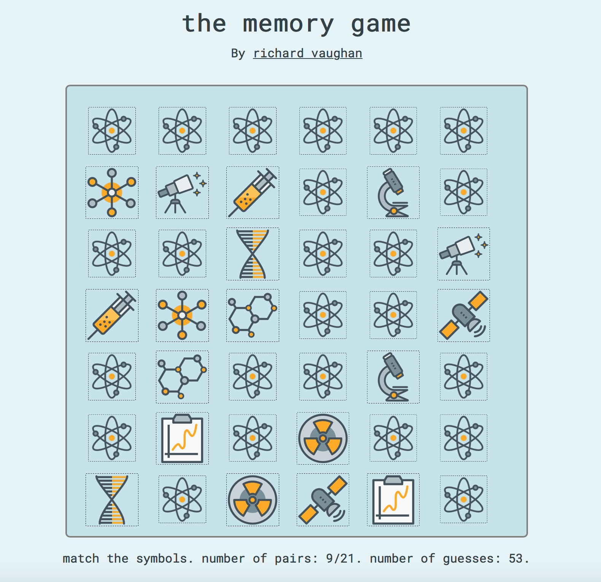

## The Memory Game 🧠

A browser-based javascript game to test your memory.

## How to Play

Match all of the pairs of symbols in the least number of guesses. You can play <a href=https://www.richvaughan.co.uk/pages/memorygame/play.html>here</a>. Enjoy! 

It should work in most modern desktop and mobile browsers.

## Credits:
* This project is an adaptation of the script shown in <a href="https://www.youtube.com/watch?v=ZniVgo8U7ek">this</a> YouTube tutorial.
* It uses Nicholas Gallagher's <a href="http://necolas.github.io/normalize.css/">normalize.css</a> for better cross-browser compatibility.
* It uses <a href="https://tympanus.net/codrops/2016/01/29/freebie-science-line-icons/">this</a> free icon set.

## To Add in Future Versions:
* Add sound effects / music
* Add a timer for players to track their progress
* Implement a method for storing a player's best score/time (or a leaderboard)
* Fix any bugs

